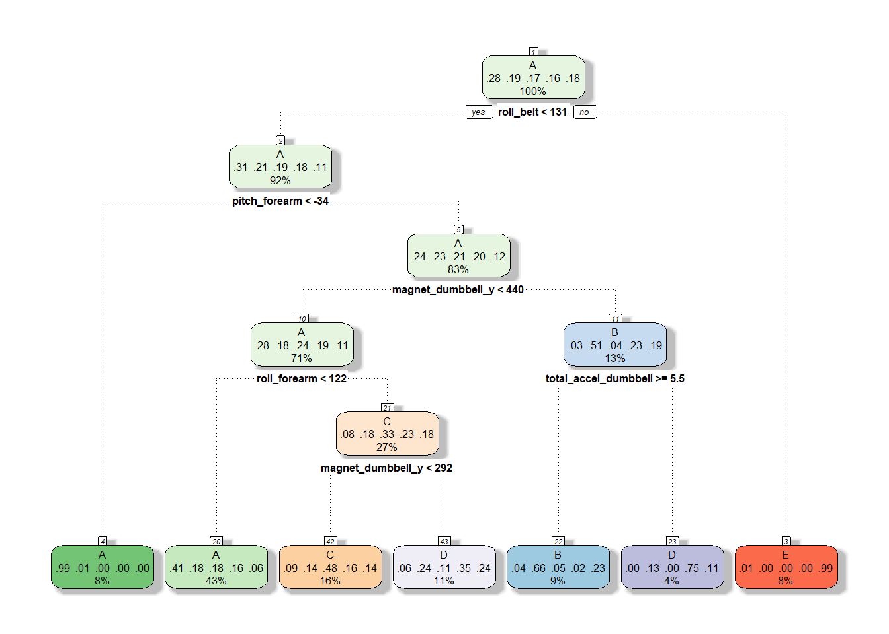
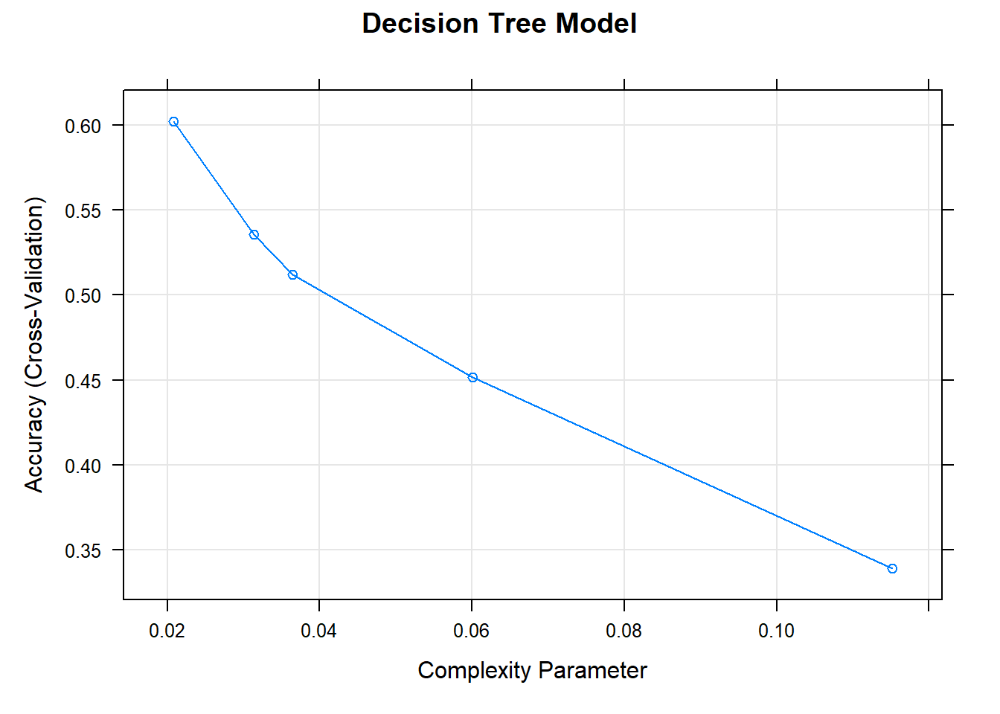
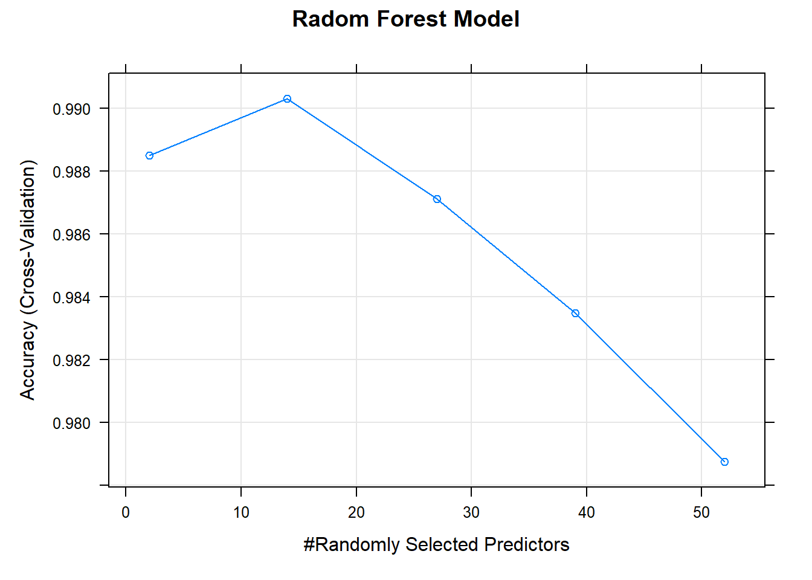
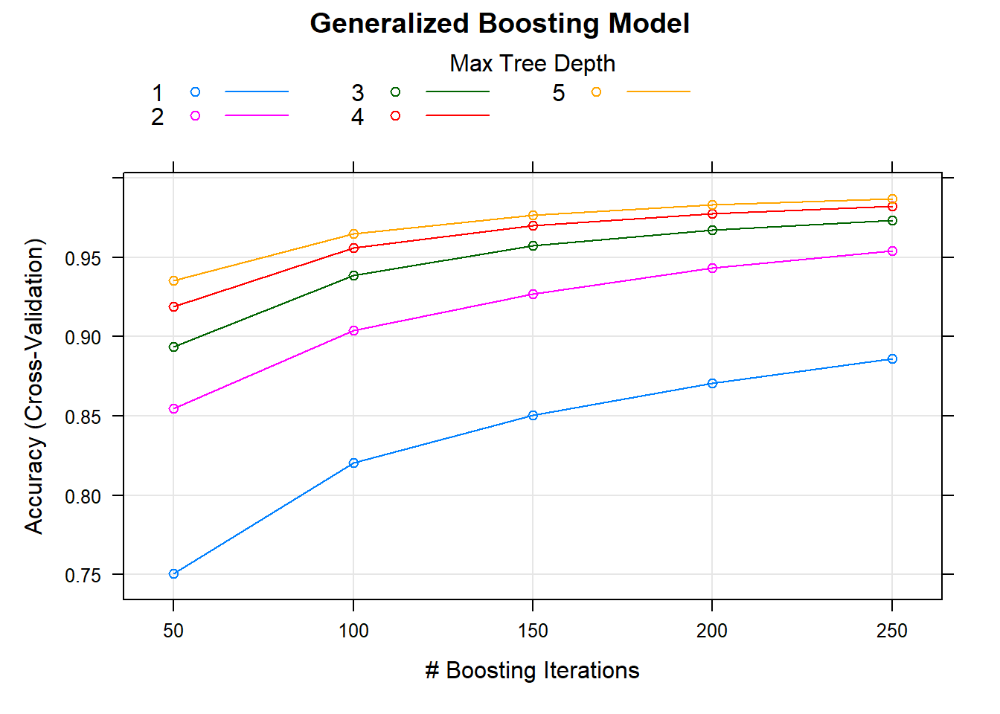

## Introduction
In this project, our goal will be to use data from accelerometers on the belt, forearm, arm, and dumbell of 6 participants. They were asked to perform barbell lifts correctly and incorrectly in 5 different ways. The questions we need to answer is : how you built your model, how you used cross validation, what you think the expected out of sample error is, and why you made the choices you did. 

## Load data sets

```r
urltrain <- "https://d396qusza40orc.cloudfront.net/predmachlearn/pml-training.csv"
urltest <- "https://d396qusza40orc.cloudfront.net/predmachlearn/pml-testing.csv"
download.file(urltrain, destfile = "pml_training.csv")
download.file(urltest, destfile = "pml_testing.csv")
pml_training <- read.csv("pml_training.csv")
pml_testing <-read.csv("pml_testing.csv")
```

## Load libraries needed

```r
library(caret)
library(gbm)
library(rpart)
library(rattle)
```

## Cleaning data
After take a look at the data, we found there are 19622 observations and 160 variables in the original training set. And there are a lot of NAs and "" in the data set, so we need to exclude variables including most NAs and the first 7 variables which are irrelevant to the outcome.

```r
## cleaning of data sets
set.seed(1234)
pml_training_comp<- pml_training[,colMeans(is.na(pml_training)) < .9] ## remove most NA variables
pml_training_comp<-pml_training_comp[,-c(1:7)] ## remove irrelevant variables to the outcome
nvz <- nearZeroVar(pml_training_comp) ## remove near sero variance variables
pml_training_comp<- pml_training_comp[,-nvz]
dim(pml_training_comp) ## check the dimension of data set
```

```
## [1] 19622    53
```

For cross validation, split the training data set to training and testing data sets.

```r
inTrain <- createDataPartition(y=pml_training_comp$classe, p=0.7,list=FALSE)
training <- pml_training_comp[inTrain,]
testing <- pml_training_comp[-inTrain,]
```

## Models fitting and testing
In this project, we will build models in three methods: decision tree, random forest, and generalized boosted model, then we will compare the accuracy of these models to select the best one for the prediction.


```r
##instruct train to use 3-fold CV to select optimal tuning parameters
fitControl <- trainControl(method="cv", number=3, verboseIter=F)
```

### 1. Decision tree

```r
set.seed(12345)
modFit_DT <- train(classe ~., method="rpart", trControl=fitControl, tuneLength = 5, data = training)
fancyRpartPlot(modFit_DT$finalModel, sub = "")
```

<!-- -->

Prediction

```r
predDT <- predict(modFit_DT, testing)
cm_DT <- confusionMatrix(predDT, factor(testing$classe))
cm_DT
```

```
## Confusion Matrix and Statistics
## 
##           Reference
## Prediction    A    B    C    D    E
##          A 1519  473  484  451  156
##          B   28  355   45   10  130
##          C   83  117  423  131  131
##          D   40  194   74  372  176
##          E    4    0    0    0  489
## 
## Overall Statistics
##                                           
##                Accuracy : 0.5366          
##                  95% CI : (0.5238, 0.5494)
##     No Information Rate : 0.2845          
##     P-Value [Acc > NIR] : < 2.2e-16       
##                                           
##                   Kappa : 0.3957          
##                                           
##  Mcnemar's Test P-Value : < 2.2e-16       
## 
## Statistics by Class:
## 
##                      Class: A Class: B Class: C Class: D Class: E
## Sensitivity            0.9074  0.31168  0.41228  0.38589  0.45194
## Specificity            0.6286  0.95512  0.90492  0.90165  0.99917
## Pos Pred Value         0.4927  0.62500  0.47797  0.43458  0.99189
## Neg Pred Value         0.9447  0.85255  0.87940  0.88228  0.89002
## Prevalence             0.2845  0.19354  0.17434  0.16381  0.18386
## Detection Rate         0.2581  0.06032  0.07188  0.06321  0.08309
## Detection Prevalence   0.5239  0.09652  0.15038  0.14545  0.08377
## Balanced Accuracy      0.7680  0.63340  0.65860  0.64377  0.72555
```

### 2. Random forest

```r
set.seed(12345)
modFit_RF <- train(classe ~., method="rf", trControl=fitControl, tuneLength = 5, data = training, prox=TRUE)
```

Prediction

```r
predRF <- predict(modFit_RF, testing)
cm_RF <- confusionMatrix(predRF, factor(testing$classe))
cm_RF
```

```
## Confusion Matrix and Statistics
## 
##           Reference
## Prediction    A    B    C    D    E
##          A 1673    3    0    0    0
##          B    1 1132   10    0    0
##          C    0    4 1014    6    0
##          D    0    0    2  957    0
##          E    0    0    0    1 1082
## 
## Overall Statistics
##                                          
##                Accuracy : 0.9954         
##                  95% CI : (0.9933, 0.997)
##     No Information Rate : 0.2845         
##     P-Value [Acc > NIR] : < 2.2e-16      
##                                          
##                   Kappa : 0.9942         
##                                          
##  Mcnemar's Test P-Value : NA             
## 
## Statistics by Class:
## 
##                      Class: A Class: B Class: C Class: D Class: E
## Sensitivity            0.9994   0.9939   0.9883   0.9927   1.0000
## Specificity            0.9993   0.9977   0.9979   0.9996   0.9998
## Pos Pred Value         0.9982   0.9904   0.9902   0.9979   0.9991
## Neg Pred Value         0.9998   0.9985   0.9975   0.9986   1.0000
## Prevalence             0.2845   0.1935   0.1743   0.1638   0.1839
## Detection Rate         0.2843   0.1924   0.1723   0.1626   0.1839
## Detection Prevalence   0.2848   0.1942   0.1740   0.1630   0.1840
## Balanced Accuracy      0.9993   0.9958   0.9931   0.9962   0.9999
```

### 3. Generalized boosting model

```r
set.seed(12345)
modFit_GBM <- train(classe ~., method="gbm", trControl=fitControl, tuneLength = 5, verbose = F, data = training)
```

Prediction

```r
predGBM <- predict(modFit_GBM, testing)
cm_GBM <- confusionMatrix(predGBM, factor(testing$classe))
cm_GBM
```

```
## Confusion Matrix and Statistics
## 
##           Reference
## Prediction    A    B    C    D    E
##          A 1672    8    0    0    0
##          B    1 1125   15    0    0
##          C    1    6 1010    7    1
##          D    0    0    1  954    1
##          E    0    0    0    3 1080
## 
## Overall Statistics
##                                         
##                Accuracy : 0.9925        
##                  95% CI : (0.99, 0.9946)
##     No Information Rate : 0.2845        
##     P-Value [Acc > NIR] : < 2.2e-16     
##                                         
##                   Kappa : 0.9905        
##                                         
##  Mcnemar's Test P-Value : NA            
## 
## Statistics by Class:
## 
##                      Class: A Class: B Class: C Class: D Class: E
## Sensitivity            0.9988   0.9877   0.9844   0.9896   0.9982
## Specificity            0.9981   0.9966   0.9969   0.9996   0.9994
## Pos Pred Value         0.9952   0.9860   0.9854   0.9979   0.9972
## Neg Pred Value         0.9995   0.9970   0.9967   0.9980   0.9996
## Prevalence             0.2845   0.1935   0.1743   0.1638   0.1839
## Detection Rate         0.2841   0.1912   0.1716   0.1621   0.1835
## Detection Prevalence   0.2855   0.1939   0.1742   0.1624   0.1840
## Balanced Accuracy      0.9985   0.9922   0.9907   0.9946   0.9988
```

## Accuracy and out of sample errors of three models

                accuracy  oos_error
         Tree    0.5366    0.4634
         RF      0.9954    0.0042
         GBM     0.9925    0.0075

## Conclusion

From the table above, we can draw a conclusion that random forest model fits the data best with 0.9954 accuracy and 0.0042 out of sample error rate. Thus, we use this model to predict on test set.

## Prediction on test set

```r
predTest <- predict(modFit_RF, pml_testing)
predTest
```

```
##  [1] B A B A A E D B A A B C B A E E A B B B
## Levels: A B C D E
```

## Appendix
Plotting the models

```r
plot(modFit_DT, main="Decision Tree Model")
```

<!-- -->

```r
plot(modFit_RF, main="Radom Forest Model")
```

<!-- -->

```r
plot(modFit_GBM, main="Generalized Boosting Model")
```

<!-- -->
